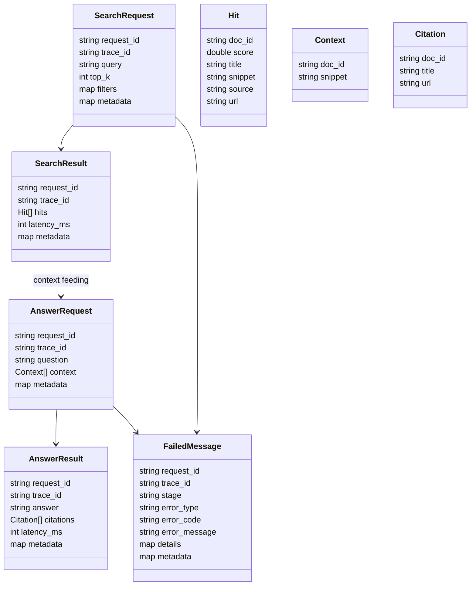
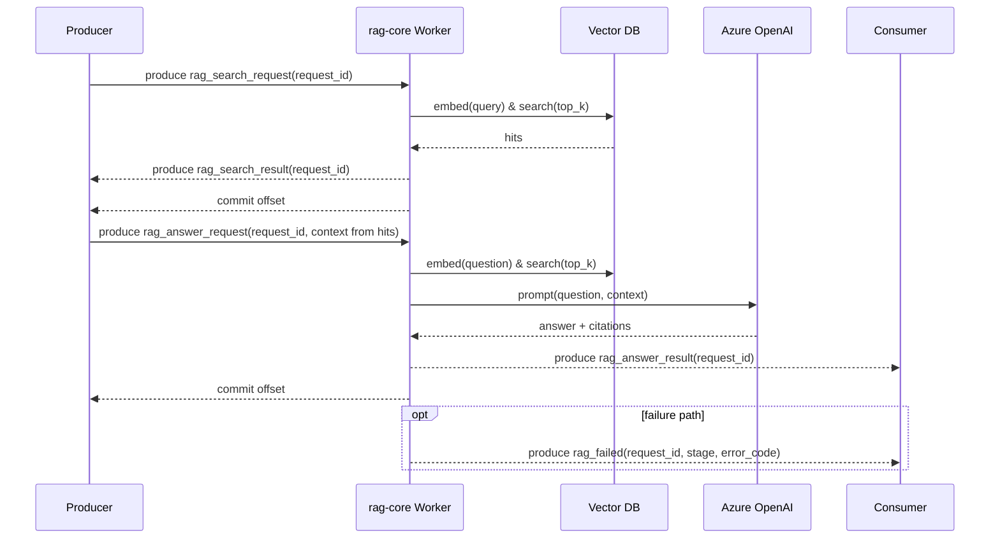

Kafka Interface Contract — rag-core
====================================

1. Overview
-----------
- rag-core 是一个基于 Kafka 驱动的 RAG 搜索与回答计算引擎。
- 从 Kafka 主题异步消费请求并产生结果；不提供同步 API。
- 在请求生命周期上无状态；仅依赖 Kafka 投递与处理。
- 请求处理与结果返回均通过 Kafka 完成。
- 协议目标：定义稳定的请求/结果结构、失败模型与交互时序，确保多语言客户端可互通。

2. Design Principles
--------------------
- 异步、消息驱动执行。
- Kafka 至少一次投递，处理语义需具备幂等性。
- 不在 rag-core 内持久化请求状态。
- 失败隔离：单条消息失败不影响其他消息处理。
- 前向兼容：新增字段一律向后兼容，消费者须忽略未知字段。
- 字符编码：所有字符串字段均为 UTF-8。
- 消息建议 < 512 KB；过大上下文请落盘对象存储并传递可访问 URL。

3. Kafka Topics
---------------
- `rag_search_request`  
  - 方向：consume  
  - 目的：接收搜索请求。  
  - Key：可选，建议使用 `request_id` 以维持分区内顺序。  
  - 顺序：分区内顺序保持；跨分区无顺序保证。  
  - 生产方启用至少一次投递；重复由 request_id 幂等处理。
- `rag_search_result`  
  - 方向：produce  
  - 目的：输出搜索结果。  
  - Key：继承请求 key（若有）或空。  
  - 顺序：由分区决定。
- `rag_answer_request`  
  - 方向：consume  
  - 目的：接收基于搜索结果的回答请求。  
  - Key：可选，建议使用 `request_id`。  
  - 顺序：分区内顺序保持。
- `rag_answer_result`  
  - 方向：produce  
  - 目的：输出最终回答。  
  - Key：继承请求 key（若有）或空。  
  - 顺序：由分区决定。
- `rag_failed`  
  - 方向：produce  
  - 目的：输出处理失败信息（搜索或回答阶段）。  
  - Key：继承原请求 key（若有）或空。  
  - 顺序：由分区决定。

4. Message Schemas
------------------

通用字段：
- `request_id`：全局唯一，结果/失败消息必须回填同值。
- `trace_id`：可选链路追踪，透传不修改。
- `metadata`：键值对透传，不参与计算；客户端不得依赖服务端写回的结构化内容。
- 未知字段：允许附加，消费者应忽略。

4.1 Search Request
- 示例：
```json
{
  "request_id": "search-001",
  "trace_id": "trace-abc",
  "query": "vector databases for production",
  "top_k": 5,
  "filters": {
    "doc_type": ["blog", "doc"],
    "lang": ["en"]
  },
  "metadata": {
    "tenant": "acme",
    "user": "uid-123"
  }
}
```
- 字段说明（验证规则）：  
  - `request_id` (必填，string)：请求全局唯一标识。  
  - `trace_id` (可选，string)：链路追踪标识。  
  - `query` (必填，string)：检索文本，不能为空字符串。  
  - `top_k` (可选，int)：期望返回文档数，>0；缺省使用平台配置。  
  - `filters` (可选，object)：检索过滤条件，键为维度，值为字符串数组；空数组等同未提供。  
  - `metadata` (可选，object)：透传上下文，不参与处理。

4.2 Search Result
- 示例：
```json
{
  "request_id": "search-001",
  "trace_id": "trace-abc",
  "hits": [
    {
      "doc_id": "doc-10",
      "score": 0.92,
      "title": "Using vector databases",
      "snippet": "Vector stores enable similarity search...",
      "source": "blog",
      "url": "https://example.com/blog/vector"
    }
  ],
  "latency_ms": 120,
  "metadata": {
    "tenant": "acme"
  }
}
```
- 字段说明：  
  - `request_id` (必填，string)：与请求对应。  
  - `trace_id` (可选，string)：链路追踪标识。  
  - `hits` (必填，array)：检索命中列表。  
    - `doc_id` (必填，string)：文档标识。  
    - `score` (必填，number)：相关性得分。  
    - `title` (可选, string)：标题。  
    - `snippet` (可选, string)：摘要片段。  
    - `source` (可选, string)：来源标签。  
    - `url` (可选, string)：可访问链接。  
  - `latency_ms` (可选，int)：搜索耗时。  
  - `metadata` (可选，object)：透传信息。

4.3 Answer Request
- 示例：
```json
{
  "request_id": "answer-001",
  "trace_id": "trace-abc",
  "question": "How to run vector databases in production?",
  "context": [
    {
      "doc_id": "doc-10",
      "snippet": "Vector stores enable similarity search..."
    }
  ],
  "metadata": {
    "tenant": "acme",
    "user": "uid-123"
  }
}
```
- 字段说明（验证规则）：  
  - `request_id` (必填，string)：请求全局唯一标识。  
  - `trace_id` (可选，string)：链路追踪标识。  
  - `question` (必填，string)：需要生成回答的问题，不能为空字符串。  
  - `context` (可选，array)：用于回答生成的上下文。  
    - `doc_id` (可选, string)：文档标识。  
    - `snippet` (可选, string)：上下文片段。  
  - `metadata` (可选，object)：透传信息。

4.4 Answer Result
- 示例：
```json
{
  "request_id": "answer-001",
  "trace_id": "trace-abc",
  "answer": "You can operate vector databases by ...",
  "citations": [
    {
      "doc_id": "doc-10",
      "title": "Using vector databases",
      "url": "https://example.com/blog/vector"
    }
  ],
  "latency_ms": 850,
  "metadata": {
    "tenant": "acme"
  }
}
```
- 字段说明：  
  - `request_id` (必填，string)：与请求对应。  
  - `trace_id` (可选，string)：链路追踪标识。  
  - `answer` (必填，string)：生成的回答内容。  
  - `citations` (可选，array)：引用来源列表。  
    - `doc_id` (可选, string)：文档标识。  
    - `title` (可选, string)：标题。  
    - `url` (可选, string)：链接。  
  - `latency_ms` (可选，int)：回答生成耗时。  
  - `metadata` (可选，object)：透传信息。

4.5 Failed Message
- 示例：
```json
{
  "request_id": "search-001",
  "trace_id": "trace-abc",
  "stage": "search",
  "error_type": "non_recoverable",
  "error_code": "invalid_payload",
  "error_message": "missing field query",
  "details": {
    "field": "query",
    "reason": "empty_or_missing"
  },
  "metadata": {
    "tenant": "acme"
  }
}
```
- 字段说明：  
  - `request_id` (必填，string)：对应失败的请求。  
  - `trace_id` (可选，string)：链路追踪标识。  
  - `stage` (必填，enum: `search` | `answer` )：失败发生阶段。  
  - `error_type` (必填，enum: `recoverable` | `non_recoverable` )：错误性质。  
  - `error_code` (必填，string)：规范化错误码。  
  - `error_message` (必填，string)：人类可读错误描述。  
  - `details` (可选，object)：结构化细节，便于调试；客户端可忽略。  
  - `metadata` (可选，object)：透传信息。

5. Processing Semantics
-----------------------
- 一条 Kafka 消息触发一次执行尝试。
- 成功执行产生且仅产生一条对应结果消息（搜索对应 `rag_search_result`，回答对应 `rag_answer_result`）。
- 执行失败产生且仅产生一条 `rag_failed` 消息。
- 仅在结果或失败消息成功写出后提交偏移量。
- 消息不会无限重试；重试策略受 Kafka 消费者配置与平台策略控制。
- 幂等性：  
  - 以 `request_id` 作为幂等键；重复请求返回同样的结果或失败消息。  
  - 结果、失败消息均包含原始 `request_id`/key 以便消费端去重。  
  - 客户端应容忍重复结果（at-least-once）；以 `request_id` 去重。

6. Error Codes (recommended)
----------------------------
- `invalid_payload`：字段缺失、类型错误或值非法。
- `embedding_failed`：向量生成失败（重试后仍失败）。
- `retrieval_failed`：向量检索或向量库不可用。
- `llm_failed`：大模型调用失败或超时。
- `timeout`：内部处理超时。
- `internal`：未分类内部错误。

7. Operational Notes
--------------------
- 消费端建议 `enable.auto.commit=false`，在结果/失败消息生产成功后显式提交偏移量。
- 生产端建议 `acks=all`、开启幂等生产者与合理 `retries`，降低丢失风险。
- 配置 `max.poll.interval.ms` 与 `session.timeout.ms` 覆盖大模型/向量检索耗时，避免被判定失联。
- 多租户场景可将 `metadata.tenant` 映射到 ACL/SASL 凭据，或在 headers 中携带租户标识。

8. Diagrams
-----------

类图（逻辑模型，Mermaid）：


Sequence（搜索→回答典型流程，Mermaid）：

